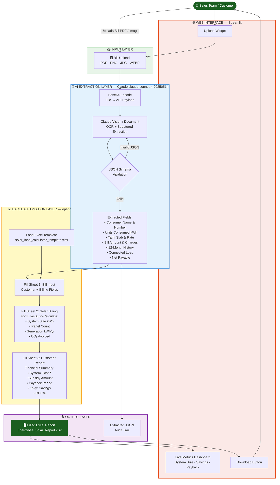

---

## System Architecture Description

### Overview
The Energybae Solar Load Calculator automates the manual process of reading an electricity bill and computing the recommended solar system size. The pipeline has 3 distinct layers:

### Layer 1 — AI Extraction (Claude claude-sonnet-4-20250514)
- The bill file (PDF or image) is base64-encoded and sent to Claude via the Anthropic Messages API
- Claude's vision/document capabilities parse the bill content and extract ~20 structured fields
- Output is validated JSON matching a predefined schema

### Layer 2 — Excel Automation (openpyxl)
- The Solar Load Calculator Excel template has 3 sheets:
  - **Bill Input** — all extracted data is written here (input cells only, formulas untouched)
  - **Solar Sizing** — formulas auto-calculate system size, generation, costs, ROI
  - **Customer Report** — a clean summary sheet that pulls values from the other two sheets
- Only input cells are populated; all formulas are preserved intact

### Layer 3 — Interface
- **CLI**: `python src/bill_extractor.py --bill bill.pdf --output report.xlsx`
- **Web App**: `streamlit run app.py` — drag-and-drop UI with live metrics and download button

### Data Flow (simplified)
```
Bill (PDF/Image)
    → Claude AI → JSON (20 fields)
        → openpyxl → Excel Template (3 sheets)
            → Download → Sales Team
```

### Key Design Decisions
| Decision | Rationale |
|---|---|
| Claude vision instead of regex OCR | Handles varied bill formats without custom parsers |
| Formulas preserved in Excel | Template stays dynamic; values update when inputs change |
| JSON audit trail | Every extraction is logged for QA and reprocessing |
| Streamlit UI | Zero-install web app; no front-end expertise needed by team |
| IFERROR wrappers on all formulas | Prevents #DIV/0! and #REF! errors on empty cells |
